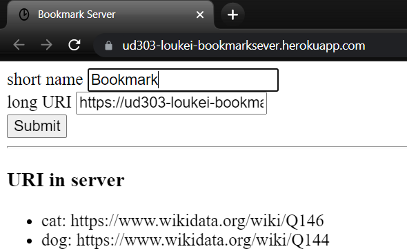

# ud303-concurrency-bookmark-server

## What's the problem?

The bookmark server can't handle over 1 request. 

If user try to use bookmark server URI (ex: "https://ud303-loukei-bookmarksever.herokuapp.com/") as bookmark, server will try to make requests for himself.



``` python
def __check_longuri(self, longuri:str)->bool:
    "Check longuri, if uri exist, return true"
    try:
        res:requests.Response = requests.get(url=longuri)
        return res.status_code == 200
    except requests.RequestException:
        return False
    except:
        return False
```

Since our server can't handle over 1 request, the server will crash instantly.

## How to fix it?

## Reference

- [ud303 - HTTP in the Real World](https://learn.udacity.com/courses/ud303/lessons/f5e2f7c1-d0ce-4738-b985-1f70fb61817d/concepts/461f4efb-c3c9-463d-9057-37e63ac879e8)